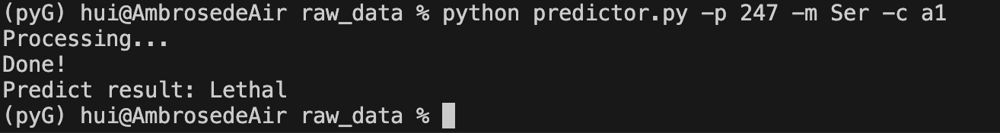

## Introduction
GraphLOGIC: Graph-based Lethality predictor for OsteoGenesis Imperfecta for Collagen is implementation osteogenesis imperfecta of model for structural-informed lethality prediction. The code is published with "Developing clinical lethality predictive model of Osteogenesis Imperfecta by using graph neural network".

On the other hand, others checkpoint and structure data were available in https://doi.org/10.6084/m9.figshare.24633969, please download checkpoint into folder.

## Environment

1. **Hardware:**
The model is training on the hardware Cpu:r5 3600 only with pytorch and pytorch_geometric framework.

2. **Package:**
All of the script are running on python, you can use conda to create visual environment and install it:
```
pip install -r requirements.txt  
```

3. **testing:**
Firstly, clone the code and download the checkpoint into the folder.
```
- bert4_final_d07 (a1 model)
- bert4_final_d15 (a1 & a2 model)
- node_embedding (sequence embedding vector)
- homo_eq (full atomic simulation data)
- crossvalidation (cross-validation data)
- dataset (OI dataset)
- figure (publishion data)
- Grad-CAM (grad-cam analysis data)
- ref-2015 (the result of xiao.2015)
- reference_structure (the structure use to build graph)
```
Secondly, the testing script need to run detial_information.py:
```
# parameter setting (d15)#
result_type = "shuffle"
result_dataset = "test" #(or total)
dataset_name =  "bert4_total_real"
save_dir = './bert4_shuffle/'
model_arch = "GAT_n_tot"
t = "a2" # (a1 or a2)

# parameter setting (d07)#
result_type = "control"
result_dataset = "test" #(or total)
dataset_name =  "bert4_ref_real"
save_dir = './bert4_control/'
model_arch = "GAT_n_tot_only"
t = "a1" # a1 only
```
Thirdly, the plot script:
```
- ploy_cv.py
- plot_pr_curve.py
- ploy_prediction_15_23.py
- plt_tsne.py
```


## Prediction

You can easy to run predicter.py to get result with position and mutation type:
```
python predictor.py -p 247 -m Ser -c a1
```
and the result:


## Citing

